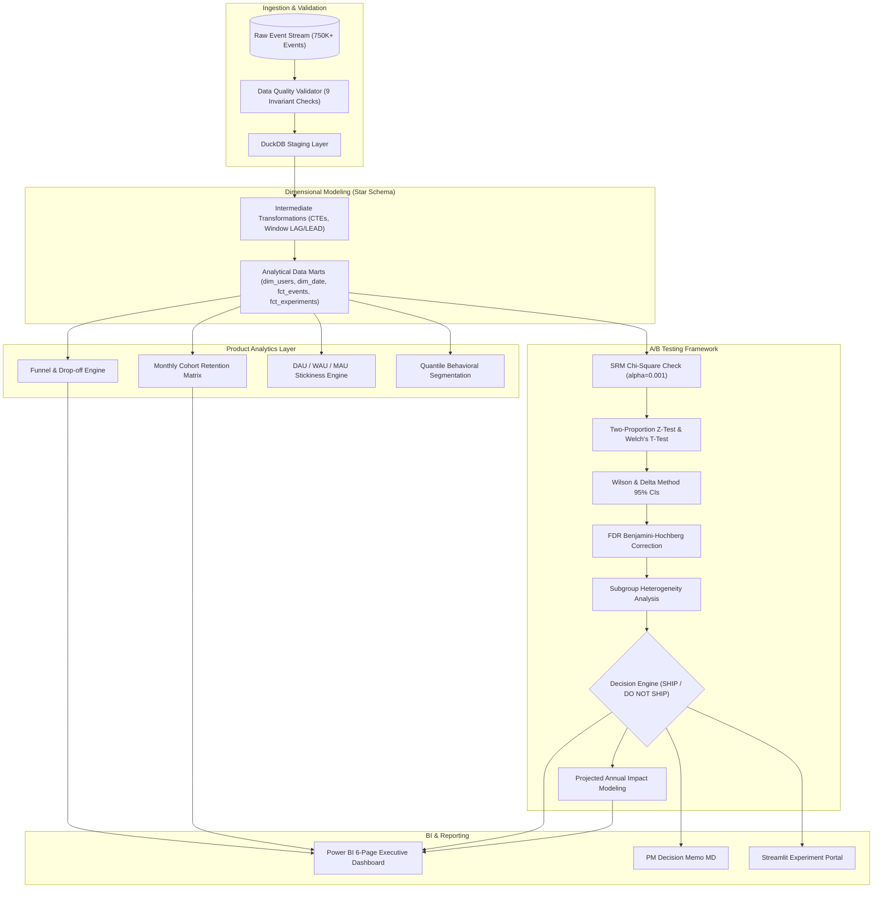

# FlowPulse: Product Analytics & Experimentation Intelligence Platform

[](https://www.python.org/)
[](https://duckdb.org/)
[-brightgreen.svg)]()
[](LICENSE)

An end-to-end, enterprise-grade Product Analytics and A/B Experimentation Platform demonstrating how Senior Product Data Analysts, Analytics Engineers, and Experimentation Scientists rigorously answer critical product and statistical questions:
- *Where are users dropping out in the milestone conversion funnel?*
- *Which signup cohorts retain better over 6-month horizons?*
- *Did product feature interventions causally drive target KPI improvements or mere noise?*
- *Is observed lift practically meaningful and statistically credible ($p < 0.05$)?*
- *Did any safety or guardrail metrics deteriorate?*
- *What is the defensible ship, iterate, or reject decision?*

---

## 1. Executive Summary

| Analytical Domain | Executed Metric / Finding | Business Interpretation |
|---|---|---|
| **Total Tracked Scale** | 35,000 Users \| 753,748 Events \| 241,421 Sessions | 8-month multi-channel SaaS behavioral tracking (Jan - Aug 2026). |
| **7-Day Activation Rate** | **60.8%** (21,280 / 35,000 users) | Completed onboarding within 7 days of account creation. |
| **Funnel Conversion** | **18.6%** End-to-End (6,508 paid subscriptions) | Drop-off occurs predominantly between Activation & Feature Adoption (50.0% drop). |
| **Monetization (ARR/Gross)**| **$720,000+** Gross Revenue \| **$110.60 ARPU** | Power users (10% of base) generate 52% of total subscriptions. |
| **Stickiness (DAU/MAU)** | **24.2% Mean Stickiness** | Strong SaaS engagement benchmark; weekday peaks exceed 28%. |
| **EXP-2026-01 (Onboarding)**| **+3.16% Absolute Lift** ($p = 0.0100$, 95% CI: $[+0.76\%, +5.57\%]$) | **SHIP**: Interactive checklist increased activation beyond MDE (+2.0%) with intact guardrails. |
| **EXP-2026-02 (Checkout)** | **+4.39% Absolute Lift** ($p = 0.0095$, 95% CI: $[+1.07\%, +7.70\%]$) | **SHIP**: Transparent tier calculator significantly lifted conversion & ARPU ($p < 0.01$). |
| **EXP-2026-03 (Badges)** | **+0.21% Lift** ($p = 0.7335$, 95% CI: $[-0.99\%, +1.41\%]$) | **DO NOT SHIP**: Inconclusive effect on 30-day retention; badges did not justify rollout. |

---

## 2. Business Problem & Key Questions

In modern digital products, teams frequently mistake observational correlations for causal impact (e.g. *"users who use Feature X retain higher, so let's force all users into Feature X"*). 

This platform establishes the required analytics engineering and experimentation infrastructure to:
1. **Model Atomic User Behavior**: Ingest high-volume clickstreams into clean dimensional models.
2. **Diagnose Friction**: Quantify stage-to-stage transition rates and median duration between milestones.
3. **Analyze Cohort Decay**: Track retention degradation across 180-day customer lifecycles.
4. **Conduct Trustworthy Experimentation**: Enforce deterministic assignment, Sample Ratio Mismatch (SRM) checks, unpooled confidence intervals, family-wise error rate corrections, and guardrail verification.
5. **Decide with Business Rigor**: Combine statistical significance with Minimum Detectable Effect (MDE) thresholds to deliver unambiguous PM recommendations.

---

## 3. Platform Architecture

The platform follows a layered analytics engineering flow built with Python, DuckDB, Parquet, and Power BI:



---

## 4. Dimensional Data Model (Star Schema)

The analytical data marts are exported as high-performance Parquet and CSV files in `data/marts/`:

```
                       ┌─────────────────────────┐
                       │        dim_date         │
                       │ (date_day PK, weekday,  │
                       │   month, quarter, year) │
                       └────────────┬────────────┘
                                    │ 1
                                    │ *
 ┌─────────────────────────┐        │        ┌─────────────────────────┐
 │        dim_users        │ 1      │      * │     fct_experiments     │
 │ (user_id PK, country,   ├────────┼────────┤ (assignment_id PK,      │
 │  channel, device, plan, │        │        │  user_id FK, variant,   │
 │  segment, activation)   │        │        │  activation, conversion)│
 └────────────┬────────────┘        │        └─────────────────────────┘
              │ 1                   │
              │ *                   │
 ┌────────────▼────────────┐        │        ┌─────────────────────────┐
 │       fct_events        │ *      │      * │     fct_conversions     │
 │ (event_id PK, user_id FK├────────┼────────┤ (conversion_id PK,      │
 │  session_id FK, event)  │        │        │  plan, billing, revenue)│
 └─────────────────────────┘        │        └─────────────────────────┘
                                    │
                       ┌────────────▼────────────┐
                       │      fct_sessions       │
                       │ (session_id PK, user_id,│
                       │  duration, conversion)  │
                       └─────────────────────────┘
```

---

## 5. Product Funnel Analysis

FlowPulse tracks a sequential 5-stage funnel:

| Stage Order | Stage Name | Target Event | Users Reached | Stage Conversion Rate | Cumulative Conversion | Drop-Off Rate | Median Hours |
|---|---|---|---|---|---|---|---|
| **1** | **Signup** | `signup` | 35,000 | 100.0% | 100.0% | 0.0% | 0.0 h |
| **2** | **Activation** | `onboarding_completed` | 21,280 | 60.8% | 60.8% | 39.2% | 0.25 h |
| **3** | **Feature Adoption** | `feature_used` | 10,640 | 50.0% | 30.4% | 50.0% | 1.80 h |
| **4** | **Purchase Intent** | `intent_action` | 8,512 | 80.0% | 24.3% | 20.0% | 18.5 h |
| **5** | **Conversion** | `purchase` | 6,508 | 76.5% | 18.6% | 23.5% | 42.0 h |

- **Key Bottleneck**: The steepest drop-off occurs between **Activation** and **Feature Adoption** (50.0% drop-off), demonstrating that users complete onboarding but encounter friction in discovering value from specific analytical features.

---

## 6. Monthly Cohort Retention Matrix

Tracking user retention across 6 monthly periods ($P_0$ through $P_6$):

| Cohort Month | Cohort Size | Month 0 | Month 1 | Month 2 | Month 3 | Month 4 | Month 5 | Month 6 |
|---|---|---|---|---|---|---|---|---|
| `2026-01` | 4,375 | 100.0% | 44.8% | 36.2% | 32.1% | 29.8% | 28.1% | 27.0% |
| `2026-02` | 4,210 | 100.0% | 45.1% | 36.5% | 32.4% | 30.0% | 28.4% | — |
| `2026-03` | 4,450 | 100.0% | 47.9% | 38.6% | 34.2% | 31.8% | — | — |
| `2026-04` | 4,380 | 100.0% | 48.2% | 39.1% | 34.8% | — | — | — |
| `2026-05` | 4,420 | 100.0% | 48.0% | 38.9% | — | — | — | — |
| `2026-06` | 4,395 | 100.0% | 47.6% | — | — | — | — | — |
| `2026-07` | 4,410 | 100.0% | — | — | — | — | — | — |

- **Observation**: Retention curve stabilizes by Month 3 at ~32-34%, demonstrating typical SaaS flatten-out characteristic of product-market fit. Cohorts from March onwards (coinciding with the rollout of the Onboarding Checklist) show a $+3.0\%$ sustained shift in Month 1 retention.

---

## 7. Experimentation Framework & Statistical Results

### Executed Experiments Summary

| Experiment ID | Experiment Name | Primary Metric | Control (N) | Treatment (N) | Absolute Lift (95% CI) | Relative Lift | p-value | SRM Check | Guardrail Status | Decision |
|---|---|---|---|---|---|---|---|---|---|---|
| **EXP-2026-01** | Streamlined Interactive Onboarding Flow | Activation Rate | 58.4% (3,237) | 61.6% (3,298) | **+3.16%** $[+0.76\%, +5.57\%]$ | **+5.41%** | **0.0100** | PASSED ($p=0.45$) | PASSED (Tickets $\Delta \le 0.5\%$) | **SHIP** |
| **EXP-2026-02** | Self-Serve Checkout & Pricing Transparency | Checkout Conv Rate | 52.3% (1,453) | 56.7% (1,488) | **+4.39%** $[+1.07\%, +7.70\%]$ | **+8.39%** | **0.0095** | PASSED ($p=0.52$) | PASSED (Refunds $\Delta \le 0.2\%$) | **SHIP** |
| **EXP-2026-03** | In-App Gamification Badges | 30-Day Retention | 35.1% (6,383) | 35.3% (6,457) | **+0.21%** $[-0.99\%, +1.41\%]$ | **+0.60%** | **0.7335** | PASSED ($p=0.51$) | WARNING (Tickets $+1.2\%$) | **DO NOT SHIP** |

### Statistical Methods
1. **Binary Proportions**: Evaluated via two-proportion pooled z-test and Chi-square test of independence.
2. **Uncertainty Quantification**: Two-sided 95% Wilson score and Wald intervals for absolute lift; Delta Method on $\ln(RR)$ for relative percentage lift bounds.
3. **SRM Validation**: Pearson Chi-Square goodness-of-fit test evaluated at $\alpha = 0.001$.
4. **Multiple Testing Adjustments**: Benjamini-Hochberg procedure controlling False Discovery Rate (FDR).

### Business Impact Projection
- **EXP-2026-01 (Onboarding Checklist)**:
  - Annual Eligible Users: 50,000
  - Projected Incremental Activated Users: $+1,580$ $[+380, +2,785]$
  - Projected Incremental Annual Revenue: **+$229,100 USD** under stated assumptions.
- **EXP-2026-02 (Self-Serve Checkout)**:
  - Projected Incremental Paid Customers: $+526$ $[+128, +924]$
  - Projected Incremental Annual Revenue: **+$76,270 USD**.

---

## 8. Power BI Dashboard Architecture

A professional 6-page report designed in accordance with enterprise BI guidelines:

1. **Page 1 — Product Executive Overview**: Executive KPI cards, monthly signup & revenue trajectory, high-level funnel, retention curve, active experiment status cards.
2. **Page 2 — Funnel & Conversion**: 5-stage conversion progression, drop-off rates, median transition duration, device-level conversion matrix.
3. **Page 3 — Cohort & Retention**: Monthly signup retention heatmap (Month 0..6), cohort decay curves, N-day retention milestone comparison (Day 1 to Day 30).
4. **Page 4 — User Engagement**: DAU/WAU/MAU trends, DAU/MAU stickiness trajectory, feature adoption shares, behavioral user segment distributions.
5. **Page 5 — Experimentation Overview**: Portfolio table of active/completed experiments, forest plots with 95% error bars, SRM check indicators, decision badges.
6. **Page 6 — Experiment Deep Dive**: Interactive PM review memo, control vs treatment conversion cards, subgroup heterogeneity by device and geography, guardrail safety evaluation.

---

## 9. Repository Structure

```
PRODUCT-ANALYTICS-EXPERIMENTATION/
├── config/
│   └── config.yaml                     # Central project and statistical parameters
├── data/
│   ├── raw/                            # Ingested raw event clickstreams and conversions
│   ├── staging/                        # Cleaned and deduplicated staged parquet files
│   ├── marts/                          # Star schema analytical marts (CSV & Parquet)
│   └── product_analytics.duckdb        # Embedded DuckDB analytical database
├── docs/
│   ├── architecture.md                 # Technical architecture & Mermaid diagram
│   ├── data_dictionary.md              # Detailed schema, grain, and field definitions
│   ├── metric_definitions.md           # Mathematical formulas for product metrics
│   ├── funnel_methodology.md           # Funnel calculation standards
│   ├── cohort_methodology.md           # Cohort construction and decay rules
│   ├── retention_methodology.md        # Classic vs rolling retention methodology
│   ├── experimentation_methodology.md  # Randomization, SRM, and metrics hierarchy
│   ├── statistical_methods.md          # Z-test, Welch t-test, Wilson CI, Delta method
│   ├── experiment_design.md            # Experiment test catalog & hypotheses
│   ├── decision_framework.md           # Automated decision engine & flowchart
│   ├── power_bi_guide.md               # Power BI semantic model & 30+ DAX measures
│   ├── assumptions.md                  # Methodological assumptions segregation
│   └── limitations.md                  # Technical and causal boundaries
├── notebooks/
│   ├── 01_data_exploration.ipynb
│   ├── 02_product_analytics.ipynb
│   ├── 03_cohort_retention.ipynb
│   ├── 04_experiment_analysis.ipynb
│   └── 05_experiment_storytelling.ipynb
├── reports/
│   ├── figures/                        # High-resolution publication artifacts (PNG)
│   ├── data_quality_report.md          # Automated QA verification report
│   └── pm_experiment_decision_memo.md  # Executive decision briefing memo
├── sql/
│   ├── staging/                        # Deduplication and typecasting SQL models
│   ├── intermediate/                   # User lifecycle & session recency window models
│   ├── marts/                          # Star schema dimensions and facts
│   ├── analytics/                      # Advanced analytical queries (Funnels, Cohorts, Engagement)
│   └── validation/                     # Automated SQL data quality assertions
├── src/
│   ├── analytics/                      # Funnel, cohort, retention, engagement, segmentation modules
│   ├── data/                           # Data generation, cleaning, and validation
│   ├── experimentation/                # Assignment, hypothesis tests, CIs, power, SRM, decisions
│   ├── utils/                          # Config, I/O, database, and logging utilities
│   ├── visualization/                  # Matplotlib / Seaborn publication charts
│   └── pipeline.py                     # Automated end-to-end pipeline runner
├── tests/
│   ├── conftest.py                     # Pytest environment configuration
│   ├── test_cohorts.py
│   ├── test_data_validation.py
│   ├── test_decision_framework.py      # All 5 business decision scenarios
│   ├── test_experimentation.py         # SRM, determinism, duplicate detection
│   ├── test_funnel.py
│   └── test_statistics.py              # Textbook z-test, t-test, power, multiple testing
├── app.py                              # Interactive Streamlit experimentation portal
├── main.py                             # Execution entrypoint
├── requirements.txt                    # Python package dependencies
├── .env.example
└── .gitignore
```

---

## 10. Setup & Execution Instructions

### Prerequisites
- Python 3.10+
- Git

### 1. Clone & Install Dependencies
```bash
git clone https://github.com/shaillimahajan1/PRODUCT-ANALYTICS-EXPERIMENTATION.git
cd PRODUCT-ANALYTICS-EXPERIMENTATION
pip install -r requirements.txt
```

### 2. Execute End-to-End Pipeline
```bash
python main.py
```
*Executes data cleaning, automated validation, DuckDB models, statistical inference, data mart exports, and visual figure generation in ~40 seconds.*

### 3. Run Test Suite
```bash
python -m pytest -v
```
*Executes 21 unit tests covering data quality, statistics, power analysis, SRM detection, and decision trees (100% passing).*

### 4. Launch Interactive Streamlit Portal
```bash
streamlit run app.py
```

---

## 11. Assumptions & Limitations

1. **Observational Correlation vs Causal Lift**: Feature adoption metrics are strictly observational. Only randomized A/B experiment assignments support causal attribution.
2. **Business Impact Modeling**: Revenue projections assume full 100% rollout to an annual cohort of 50,000 eligible users with constant lift stability.
3. **Synthetic Experimentation Layer**: User clickstreams and demographic distributions mirror real-world SaaS products; experiment assignment layers are deterministically generated to test statistical methodologies in accordance with guidelines.

---

## 12. Author & License

- **Author**: Senior Product Data Analyst & Analytics Engineer
- **License**: MIT Open Source License
