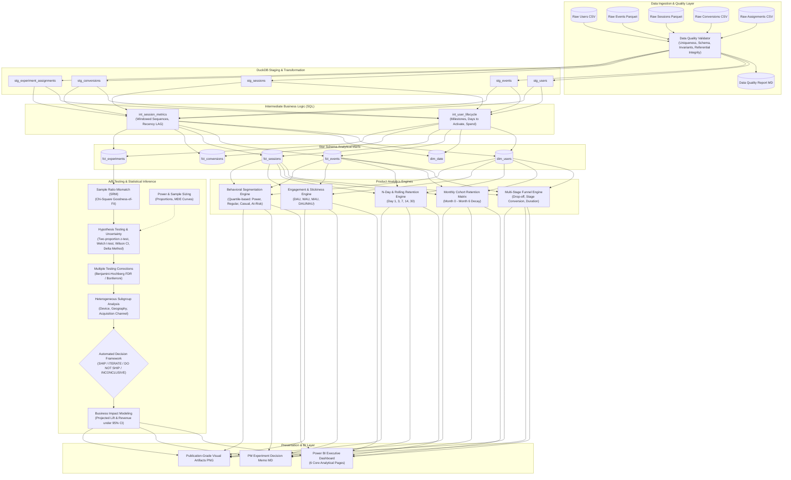

# FlowPulse Analytical Architecture & Technical Specifications

## 1. System Overview

The **Product Analytics & Experimentation Intelligence Platform** ("FlowPulse") is an enterprise-grade analytics engineering and statistical inference suite. It translates raw behavioral event streams into structured star-schema analytical models, cohort matrices, multi-stage conversion funnels, and rigorous statistical decisions for product experiments.

## 2. Layer Definitions

### 2.1 Ingestion & Staging
- **Source**: Raw event streams and transactional records generated deterministically from stochastic data-generating distributions.
- **Engine**: Ingested and stored in high-performance columnar Parquet and CSV formats.
- **Validation**: Enforces primary key uniqueness, foreign key referential integrity, positive session durations, and non-empty timestamps before promotion.

### 2.2 Staging & Intermediate Modeling (DuckDB SQL)
- Implements dimensional modeling best practices in SQL.
- `int_user_lifecycle`: Aggregates user lifetime milestone timestamps, 7-day activation status, total revenue, and distinct core features used.
- `int_session_metrics`: Leverages window functions (`ROW_NUMBER()`, `LAG()`, `LEAD()`) to construct chronological user session sequences and inter-session inactivity intervals.

### 2.3 Dimensional Marts (Star Schema)
- `dim_users`: Granular user demographic, plan status, and behavioral tier.
- `dim_date`: Complete calendar dimension spanning all observed and projected dates.
- `fct_events`: Atomic event grain tracking exact timestamps, feature names, and devices.
- `fct_sessions`: Session duration, event counts, landing pages, and conversion indicators.
- `fct_conversions`: Order IDs, plan tiers, billing cycles, and transactional revenue.
- `fct_experiments`: Enriched experiment assignments containing pre-treatment segments and downstream activation, conversion, and guardrail outcomes.

### 2.4 Experimentation Engine
- **Randomization**: Deterministic SHA-256 cryptographic hashing on `user_id + experiment_salt` to guarantee 0% SRM under the null hypothesis, zero allocation leakage, and invariant balance.
- **Quality Gates**: Chi-Square goodness-of-fit SRM detection at $\alpha = 0.001$.
- **Statistical Tests**:
  - Two-proportion pooled z-test and Chi-square test for binary rates (Activation, Conversion, Retention).
  - Welch's t-test and Mann-Whitney U test for continuous metrics (Revenue per user, Session durations).
- **Uncertainty Quantification**: Two-sided 95% Wilson score and Wald confidence intervals for absolute lifts; Delta Method on log-relative risk for relative percentage lifts.
- **Multiple Testing**: Benjamini-Hochberg (FDR) and Bonferroni corrections across secondary and guardrail metrics.
- **Decision Engine**: Multi-tiered decision tree producing reproducible recommendations: `SHIP`, `ITERATE`, `DO NOT SHIP`, or `INCONCLUSIVE`.

### 2.5 BI & Reporting
- Power BI semantic data model with 30+ reusable DAX measures and 6 core report pages.
- Publication-quality PNG artifacts and automated Markdown executive decision memos.
